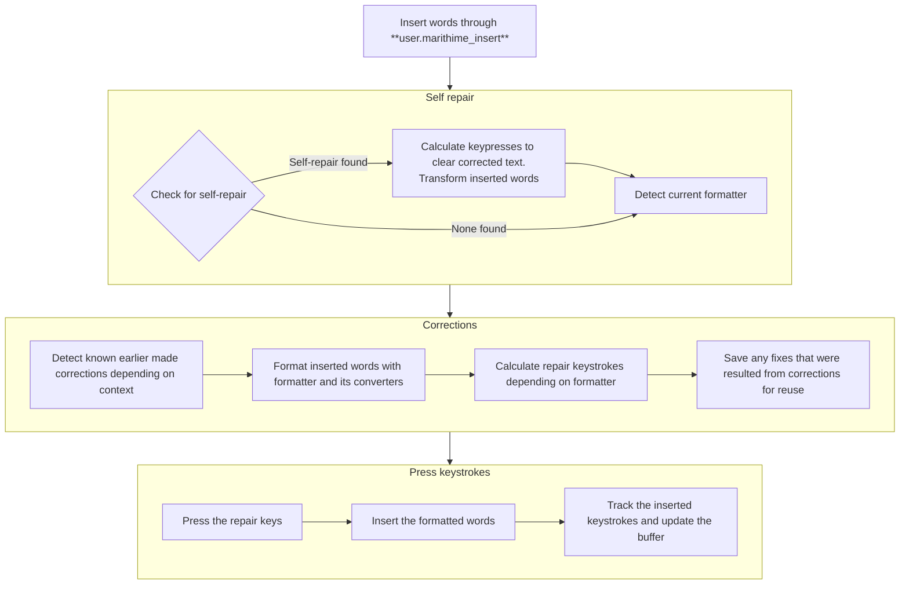

# Architecture

Because this package does a lot of things in the background, it doesn't have a simple architecture.
The basic flow of inserting text through `user.marithime_insert` is the following, parts of the diagram can be clicked on to go to specific implementations:

## Fuzzy matching

In order to determine what words to select or correct, we rely on fuzzy matching.  

Basically what that boils down to is:
- Check how similar my pronounced words are to the text available
- If the match is above a specific threshold or value, consider it a match

Most of that is done through checking [phonetic similarity](#phonetics). If it roughly matches what a word sounds like, it can be a match. But to reduce errors, we use different thresholds for [selection](#selection), [correction](#correction) and [self-repair](#self-repair).

This fuzzy matching also combines words ( `And sure` and `ensure` are similar ) and also allows the skipping of words (`the burly strong` can match `the burly and strong` ). When something is a match, and what match to pick, is based on rules written down in the `virtual_buffer/matcher.py` code and verified to what is expected through about 1500 unit test cases.

At the time of writing, the tests show a 95% accuracy in the current benchmarks, so it should be wrong about 1 in 20 times. However, we can always tweak the rules if more cases show up.

### Phonetics

The phonetic similarity, or how similar something sounds, is checked through turning the text into roughly similar letters. `The` and `de` both become `de`, `all` and `Al` will become `al`. The rules on how this process happens varies per language, and can be tweaked inside `phonetics/language/english.py` for english comparisons.

Once we have this text converted, we compare it using [Levenshtein distance](https://en.wikipedia.org/wiki/Levenshtein_distance). 

Note that, while this doesn't always give the perfect comparison, we are aiming for good enough. 

### Selection

Selection tries to match with the best possible match and select that word. That means it is also more punishing, not pronouncing the word you are attempting to select might result in the selection not executing.

Selection happens through keypresses ( moving to the left ), holding down shift and going to the right again.

### Correction

Correction tries to match with the closest best match. The idea being that you will probably want to correct something right when you have made a mistake rather than after dictating a whole paragraph.

It also persists [automatic fixes](#auto-fixer) for future dictation, if it detected a specific correction. That way, inserted text might become auto-corrected into something that you have fixed a lot of times in the past.

### Self-repair

[Self repair](https://emcawiki.net/Self-repair) is something you use in regular everyday speech. When you insert text, it looks back a couple of words in the past to determine if you were actually repeating yourself and thus attempted a correction.

Self repair only happens if you haven't selected text, and it only selects text before the caret inside the text.

Self repair stops detecting at the nearest dot `.` or other punctuation marks. This is to ensure that  the following sentences: `This is Circe. Circe will be joining us`, do not get turned into `This is Circe will be joining us`.

## Indexing

This package relies on knowing what program we are in, what text is available inside a text field, and where the caret is inside of that text field. But in order to do that effectively, we rely on a couple of strategies.

### Context tracking

In order to determine in what program we are currently inside of, we keep track of the window switches. This way we can keep a buffer of what text is available on a per program, per file basis. Instead of having to reindex constantly, it can rely on earlier known text to estimate where in the text field the caret is, and what text is inside of it.

### Input tracking

Input tracking is used to remember what text was typed through Talon Voice. This makes it possible to enhance your own voice commands with marithime commands. While we cannot track key presses outside of Talon Voice, this strategy does allow us to have the possibility of remembering where words are within programs that don't have a proper [accessibility api](#accessibility-apis).

It also tries to guess whether we need to do more indexation if an undo was done through `Ctrl-Z`.

If you don't want this tracking, please refer to the [Privacy statement](../README.md#privacy-statement) on how to turn it off.

### Accessibility APIs

In the best case, we can make use of the available accessibility APIs ( not supported in Linux though ). This allows us to rapidly read the text from the text field and where the caret is without having to rely on keystrokes or other hacks.

Sometimes we cannot find the caret position due to bad implementation of accessibility APIs by the program. In that case, we attempt to find the location of the caret by inserting a [zero-width space](https://en.wikipedia.org/wiki/Zero-width_space), reading the full text, and backspacing the zero-width space again before continuing to insert text.

### Clipboard

If we can't (fully) rely on accessibility APIs, we make use of the clipboard. This means that the program will select text, copy the text to index it, before deselecting the text again. This strategy will only happen if we determine that there is no way to know where in the text the caret is, because it takes a while to complete and might cause problems with the clipboard.

## Formatters

Formatters convert spoken text into formatted text, and can reconvert formatted text into spoken text again. A dictated language is also a formatter. The words `the biggest ship` will be converted to `The biggest ship` in the english dictation formatter, but if we are already in the middle of a sentence, like `I want to embark on`, it will instead convert to ` the biggest ship` ( with a space in front, without capitalization ). It uses the text before it to determine how to format text.

Formatters can be built off of multiple converters, that help with individual parts of the text to be converted.

Formatters used for text is remembered within the virtual buffers. This means you can set an all-caps formatter, pause, and then continue talking to have the all-caps formatter still active. It also allows us to select text with a certain formatter, replace the text with a correction, and have it use the exact same formatter that was there before.

It does however mean that sometimes forgets what formatting was there and accidentally use the default formatter instead.

### Converters

Converters can help transform text, like capitalizing the first word of a sentence.
They also help with formatting that has already happened, or choose not to format based on the context before or after it.

Let's take the english punctuation ( `converters/english_punctuation.py` ) converter as an example. If we have the text `I want to embark`, and we say `period`, the english punctuation converter insert the `.` character.

If, however, we say `the biggest ship for a period of time`, it will not insert the `.` character. Because it knows `a ` comes before the word `period`, it can decide not to change the word `period` to a `.` because it wouldn't make sense to add a sentence ending dot after the word `a`.

### Repair keys

Sometimes, we don't only need to add text through the converter process, but remove text as well. The formatter can return a list of keys to press to fix common errors. For the sentence formatter, we press a backspace if we add punctuation after a space. This is to skip making the user have to manually remove the space before placing the dot.

## Auto fixer

TODO EXPLAIN
TODO TEST
TODO IMPLEMENT